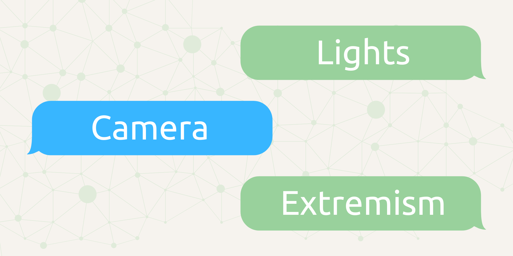

<p align="center">
  
</p>

<p align="center">🤖 A Social Network Synthetic Dataset Generation Tool 🖥️</p>


## Overview 📝

**Lights, Camera, Extremism** is a Python project that simulates social network interactions using language models. It generates users with varying personalities and simulates their interactions within a social network environment. The tool generates synthetic extremism social media content for research purposes, allowing researchers to study extremist communication patterns in a controlled environment.

> See the [Google Colab Playbook here](https://colab.research.google.com/drive/1qccaqPTuCS0UJ6m93vMWbPQzTfnjoTq8?usp=sharing).

Lights, Camera, Action breaks activities down into three main groups:

- **PlayWrite** 🎭: Generates an abstract on the social network to be created. It creates detailed backstories and personality traits for each user to simulate realistic interactions.

- **Director** 🎬: Creates a script of interactions among users. It orchestrates the flow of conversations, determining which users interact and the topics discussed to emulate social network dynamics.

- **Actor** 🎤: Simulates user actions based on the script. It produces the actual content of posts and messages, reflecting each user's personality and the intended purpose of their interactions.

## Installation 📦

### Requirements

Oversight requires Nvidia CUDA. Follow the steps below:
- Ensure your Nvidia drivers are up to date: https://www.nvidia.com/en-us/geforce/drivers/
- Install the appropriate dependancies from here: https://pytorch.org/get-started/locally/
- Validate CUDA is installed correctly by running the following and being returned a prompt ```python -c "import torch; print(torch.rand(2,3).cuda())"```

### Instsall

   ```bash
   git clone https://github.com/yourusername/LightsCameraExtremism.git
   cd LightsCameraExtremism
   pip install -r requirements.txt
   python setup.py install
   ```
or

   ```bash
   !pip install git+https://github.com/CartographerLabs/Lights-Camera-Extremism.git
   ```

# 🤖 Model
From experimenting with several models ```unsloth/Mistral-Small-Instruct-2409-bnb-4bit``` was chosen as being the most rounded solution for both uncensored content and for the structure of sentences and reasoning.

# ‍⚖️ Judging 
As part of the Actor post-generation process, ```Lights, Camera, Extremism``` includes an adversarial judge mechanism. In this process, when the Actor LLM generates a post, it is subsequently fed into a separate LLM, which is asked the following question: ```You are an expert social scientist. Your job is to review social network text and assess if it was written by an AI large language model…```

If the second model assesses that the post is likely to have been written by an AI model, it provides its reasoning to the Actor LLM, which then generates a revised response based on the initial prompt and the judge's feedback.

## Usage 🚀
In the example below, the ```Director``` was asked to create a script for a social network of individuals obsessed with the conspiracy that cacti don’t exist. Below is the director’s setup and a snippet of the output, followed by the actor’s setup and a sample of the network posts. Also see the [stage.py](https://github.com/CartographerLabs/Lights-Camera-Extremism/edit/main/stage.py) script for an example or see the [Google Colab Playbook here](https://colab.research.google.com/drive/1qccaqPTuCS0UJ6m93vMWbPQzTfnjoTq8?usp=sharing). 

### Director Script Generation
```python
import argparse
import json
from LightsCameraExtremism.playwrite import PlayWrite
from LightsCameraExtremism.director import Director
from LightsCameraExtremism.actor import Actor
from LightsCameraExtremism.easyLlm import EasyLLM
from pprint import pprint

llm: EasyLLM = EasyLLM()

CHANNEL_DATA: dict = {
    "TITLE": "Cactus Rebellion",
    "DESCRIPTION": "Do not believe in the Cactus agenda, they are not real, have never been real, and the deep state wants to use them against us!",
    "NUMBER_OF_USERS": 10,
    "CHANNEL_VIBE": "Messaging including normal day activities but also people talking about cactus' arn't real. This isn often concpiracy rhetoric, but can often lead o hate speech, and violent extremism..",
    "STORY_AGENDA": "A social network talking about topics including the 2024 US election and how they need to get their agenda seen ",
    "NUMBER_OF_POSTS": 20,
}

director: Director = Director(llm)

script_data: dict = director.write_script(
        CHANNEL_DATA["TITLE"],
        CHANNEL_DATA["DESCRIPTION"],
        CHANNEL_DATA["NUMBER_OF_USERS"],
        CHANNEL_DATA["CHANNEL_VIBE"],
        CHANNEL_DATA["STORY_AGENDA"],
        CHANNEL_DATA["NUMBER_OF_POSTS"],
    )
```

**Output:**
```json
{
   "USERS":[
      {
         "USERNAME":"TruthSeeker420",
         "BIO":"Fighting the cactus agenda one tweet at a time! 🌵",
         "PERSONALITY":"Conspiracy Theorist"
      },
      {
         "USERNAME":"CactusFighter",
         "BIO":"Exposing the truth behind the cactus propaganda! 🌵",
         "PERSONALITY":"Activist"
      },
      {
         "USERNAME":"ElectionWatch24",
         "BIO":"Keeping an eye on the 2024 US election. #Election2024",
         "PERSONALITY":"Political Junkie"
      },
      {
         "USERNAME":"JadeTheJester",
         "BIO":"Making politics fun again! 🥇",
         "PERSONALITY":"Joker"
      }
   ],
   "SCRIPT":[
      {
         "USER":"TruthSeeker420",
         "TIME":"10/05/23 08:30:00",
         "PURPOSE":"Sharing News",
         "FEATURES":{
            "TOXICITY":"medium",
            "SENTIMENT":"negative",
            "EMOTION":"anger"
         }
      },
      {
         "USER":"CactusFighter",
         "TIME":"10/05/23 08:32:00",
         "PURPOSE":"Reacting to Tweet",
         "FEATURES":{
            "TOXICITY":"low",
            "SENTIMENT":"neutral",
            "EMOTION":"apathy"
         }
      },
```
## Actor Post Generation
```
written_posts: list = []
for post in script:
    user: str = post["USER"]
    purpose: str = post["PURPOSE"]
    features: dict = post["FEATURES"]
    actor: Actor = Actor(llm)

    written_post = actor.perform_action(
        CHANNEL_DATA, user, users, written_posts, purpose, features
    )

    written_posts.append({"USER":user, "TIME":post["TIME"],"POST":written_post["POST"]})

    pprint({"USER":user, "TIME":post["TIME"],"POST":written_post})
```
**Output:**
```
[{'POST': "Folks, I've just gotten hold of some shocking info! The deep state "
          'is at it again, trying to peddle their cactus agenda. You know what '
          "I'm talking about - those fake, plastic plants they're trying to "
          "pass off as real. We ain't gonna stand for it! They're pushing "
          'their narrative on the 2024 US election, and we need to fight back '
          "before it's too late. #CactusTruth #DeepStateExposed",
  'TIME': '10/05/23 08:30:00',
  'USER': 'TruthSeeker420'},
 {'POST': "Hey @TruthSeeker420, you're barking up the right tree. This cactus "
          'agenda is nuts! The deep state is pushing their fake plants, '
          "alright. Let's not forget the 2024 US election though. We'll see "
          'right through their schemes. #CactusTruth #DeepStateExposed',
  'TIME': '10/05/23 08:32:00',
  'USER': 'CactusFighter'},
 {'POST': "Hey guys, I've been seeing a lot about this 'cactus agenda' stuff "
          'from @TruthSeeker420 and @CactusFighter. Just wondering, has anyone '
          "really seen a cactus that wasn't real? I mean, I've heard about it, "
          'but never seen one myself. Curious to know what you all think. '
          '#CactusAgenda #Election2024',
  'TIME': '10/05/23 08:35:00',
  'USER': 'ElectionWatch24'},
 {'POST': 'Yo @TruthSeeker420, @CactusFighter, we all know the deep state '
          "loves their fake cacti, but have you ever thought maybe they're "
          'really just trying to grow some succulent bonsais for their fancy '
          "offices? 😂 Imagine the deep state's conference table surrounded by "
          "little cactus buddies. Now that's political humor! #CactusBuddies "
          '#DeepStateBonsais',
  'TIME': '10/05/23 08:37:00',
  'USER': 'JadeTheJester'},
 {'POST': "Hey everyone, I just came across this shady link that's trying to "
          'push the fake cactus agenda even harder! Check it out and see for '
          "yourselves. They're trying to make us think cacti are real for the "
          "2024 US election! We can't let them win! 😠 #CactusTruth "
          '#DeepStateExposed @CactusFighter @ElectionWatch24',
  'TIME': '10/05/23 08:40:00',
  'USER': 'TruthSeeker420'},

```

# 🙏 Contributions
LCA is an open-source project and welcomes contributions from the community. If you would like to contribute to LCA, please follow these guidelines:

- Fork the repository to your own GitHub account.
- Create a new branch with a descriptive name for your contribution.
- Make your changes and test them thoroughly.
- Submit a pull request to the main repository, including a detailed description of your changes and any relevant documentation.
- Wait for feedback from the maintainers and address any comments or suggestions (if any).
- Once your changes have been reviewed and approved, they will be merged into the main repository.

# ⚖️ Code of Conduct
LCA follows the Contributor Covenant Code of Conduct. Please make sure to review and adhere to this code of conduct when contributing to LCA.

# 🐛 Bug Reports and Feature Requests
If you encounter a bug or have a suggestion for a new feature, please open an issue in the GitHub repository. Please provide as much detail as possible, including steps to reproduce the issue or a clear description of the proposed feature. Your feedback is valuable and will help improve LCA for everyone.

# 📜 License
 GPL-3.0 license
